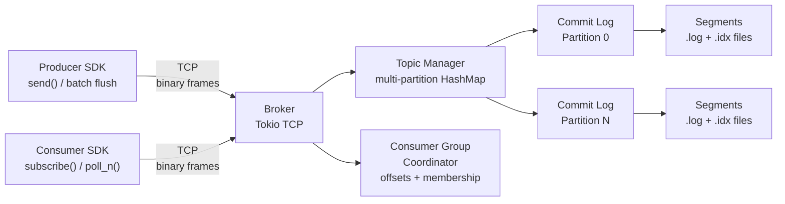

# StreamForge — Event Streaming Engine Built from Scratch in Rust


StreamForge is a from-scratch, Kafka-inspired event streaming engine written in Rust. It implements the full data path — an append-only commit log with CRC-validated records, a sparse offset index for sub-linear lookups, a binary wire protocol over TCP, multi-partition topic management, consumer group coordination with range partition assignment, and LZ4 batch compression — without wrapping any existing streaming framework.

---

## Architecture



### Module map

```
src/
├── log/
│   ├── segment.rs      Append-only file — [4B len][4B CRC32][payload]
│   ├── index.rs        Sparse Vec<(offset, file_pos)> index, binary-search + linear scan
│   └── commit_log.rs   Multi-segment Log — rotate on max_bytes, recover on reopen
├── broker/
│   ├── protocol.rs     Binary wire frames — encode/decode + async read_frame/write_frame
│   ├── topic.rs        TopicManager — HashMap<name, Topic{Vec<Partition{Log}>}>
│   ├── consumer_group.rs  Offset commits + range partition assignment
│   └── server.rs       Tokio TCP accept loop — one task per connection
├── producer/client.rs  send(), send_to_partition(), buffer_message() + flush_batch()
├── consumer/client.rs  subscribe(), poll_n(), commit_offset()
└── compression/lz4.rs  Single-record and batch LZ4 compress/decompress
```

---

## Features

- [x] **Append-only commit log** with per-record CRC32 integrity checks
- [x] **Segment rotation** — configurable `max_segment_bytes`, automatic on overflow
- [x] **Sparse offset index** — binary search + linear scan; every Nth record indexed
- [x] **Crash recovery** — `Segment::recover()` replays headers on restart
- [x] **Binary wire protocol** — length-prefixed frames, 6 opcodes (PRODUCE / FETCH / CREATE_TOPIC / COMMIT_OFFSET / RESPONSE / ERROR)
- [x] **Multi-partition topics** — independent `CommitLog` per partition
- [x] **Consumer groups** — per-(group, topic, partition) offset tracking
- [x] **Range partition assignment** — stable, deterministic assignment strategy
- [x] **Producer round-robin** — cycles partitions; configurable with explicit override
- [x] **Batch produce** — buffer messages client-side, flush in one call
- [x] **LZ4 compression** — single-record and multi-message batch compression
- [x] **73 tests** — unit, property-based (proptest), protocol round-trips, end-to-end integration

---

## Benchmark Results

Measured on Apple M-series with `cargo bench` (Criterion, release build).  
Record size: **256 bytes**. Log config: 2 GiB max segment, index interval 64.

### Append throughput

| Benchmark | Median latency | Throughput (rec/s) | Throughput (MB/s) |
|---|---|---|---|
| `append_single` — 1 record | 3.44 µs | ~291 K | ~74 |
| `append_batch_100` — 100 records | 353 µs _(3.53 µs/rec)_ | ~283 K | ~72 |
| `append_batch_1000` — 1 000 records | 3.29 ms _(3.29 µs/rec)_ | ~304 K | ~78 |

> Each append includes a `BufWriter` flush (fsync-free) and CRC32 computation.  
> Amortised cost per record is flat because the bottleneck is the write syscall.

### Read throughput

| Benchmark | Median latency | Throughput (rec/s) | Throughput (MB/s) |
|---|---|---|---|
| `read_sequential` — 1 000 offsets | 24.1 ms _(24.1 µs/rec)_ | ~41.5 K | ~10.6 |
| `read_random` — 100 offsets from 10 K-record log | 2.70 ms _(27.0 µs/read)_ | ~37 K | ~9.5 |

> Reads involve an `lseek` + `read` per record (no mmap in the current implementation).  
> Sequential reads benefit slightly from OS readahead; random reads do not.

### LZ4 compression (100 × 256 B batch)

| Benchmark | Median latency | Throughput |
|---|---|---|
| `lz4_roundtrip` (compress + decompress) | 6.59 µs | 3.62 GiB/s |
| `lz4_decompress_only` | 4.53 µs | 5.26 GiB/s |

---

## Wire Protocol

Frame layout:

```
[4 bytes: body_length (u32 LE)]   ← does NOT count these 4 bytes
[1 byte:  opcode                ]
[N bytes: body                  ]
```

| Opcode | Hex | Direction | Body layout |
|---|---|---|---|
| `PRODUCE` | `0x01` | Client → Broker | `[2B topic_len][topic][4B partition][4B payload_len][payload]` |
| `FETCH` | `0x02` | Client → Broker | `[2B topic_len][topic][4B partition][8B offset]` |
| `CREATE_TOPIC` | `0x03` | Client → Broker | `[2B name_len][name][4B num_partitions]` |
| `COMMIT_OFFSET` | `0x04` | Client → Broker | `[2B group_len][group][2B topic_len][topic][4B partition][8B offset]` |
| `RESPONSE/OK` | `0x80 0x00` | Broker → Client | _(empty)_ — CreateTopic, CommitOffset ack |
| `RESPONSE/OFFSET` | `0x80 0x01` | Broker → Client | `[8B offset]` — ProduceAck |
| `RESPONSE/PAYLOAD` | `0x80 0x02` | Broker → Client | `[8B offset][4B payload_len][payload]` — FetchData |
| `ERROR` | `0x81` | Broker → Client | `[1B code][2B msg_len][msg]` |

All multi-byte integers are **little-endian**. Maximum frame size: **64 MiB**.

---

## On-Disk Format

Each partition of a topic is stored as a sequence of segment pairs under `data/<topic>/partition-N/`:

```
00000000000000000000.log   — record data
00000000000000000000.idx   — sparse offset index (every 64th record by default)
00000000000000008192.log   — next segment after rotation
...
```

**Record layout** inside `.log` files:

```
[4 bytes: payload_length (u32 LE)]
[4 bytes: CRC32 of payload  (u32 LE)]
[N bytes: payload]
```

**Index layout** inside `.idx` files — fixed 16-byte entries:

```
[8 bytes: logical_offset  (u64 LE)]
[8 bytes: file_byte_pos   (u64 LE)]
```

---

## Build & Run

```bash
# Prerequisites: Rust 1.80+ (https://rustup.rs)

# Build (debug)
cargo build

# Build (release)
cargo build --release

# Run broker (defaults: port 9876, data dir ./data)
cargo run --release

# Run with custom options
cargo run --release -- --port 19876 --data-dir /var/lib/streamforge

# Run all 73 tests
cargo test

# Run benchmarks (generates HTML reports in target/criterion/)
cargo bench

# Lint
cargo clippy -- -D warnings
```

---

## Design Decisions

### Why an append-only log?

Appending to the end of a file is the fastest possible write pattern — it avoids random seeks, leverages OS write buffering, and makes recovery trivial (replay from the start). Kafka, RocksDB's WAL, and Postgres's WAL all use the same primitive for the same reasons.

### Why CRC32?

CRC32 (via `crc32fast`, SIMD-accelerated) catches the most common failure modes — bit-flips in transit, partial writes after a crash — with negligible CPU overhead (~1 ns per 256-byte record) and zero space overhead relative to alternatives like Adler-32. SHA-256 would be overkill and ~10× slower on this workload.

### Why a sparse index instead of a dense one?

A dense index (one entry per record) would consume significant memory for large logs. A sparse index (one entry every N records) keeps the in-memory footprint tiny while bounding worst-case lookup cost to a linear scan of at most N records. At `index_interval = 64` and 256-byte records, a 1 GiB segment requires only ~65 K index entries (~1 MiB of RAM).

### Why `BufWriter` instead of `mmap`?

`memmap2` is in the dependency tree but the current implementation uses `BufWriter` for writes and `File::seek + read_exact` for reads. This is simpler to reason about for correctness (no aliasing concerns) and good enough for single-machine throughput. `mmap` is the natural next optimisation for the read path.

### Why length-prefixed frames instead of a text protocol?

Binary frames with a 4-byte length prefix parse in O(1) with no scanning for delimiters, waste zero bytes on field names, and are trivially versioned by adding new opcodes. The trade-off is debuggability — mitigated by the structured `Frame` enum and clear encode/decode functions.

---

## Consumer Group Partition Assignment

StreamForge uses the **range strategy** (same as Kafka's default):

1. Sort consumers in the group alphabetically.
2. Divide partitions into contiguous ranges; distribute left-to-right.
3. The first `num_partitions % num_consumers` consumers each receive one extra partition.

**Example — 7 partitions, 3 consumers (A, B, C):**

```
A → [0, 1, 2]   (ceil(7/3) = 3)
B → [3, 4]      (floor(7/3) = 2)
C → [5, 6]      (floor(7/3) = 2)
```

---

## What Is NOT Implemented

These are deliberate out-of-scope decisions to keep the project focused:

| Feature | Why omitted |
|---|---|
| **Replication / follower logs** | Requires consensus (Raft/ISR), a separate project in itself |
| **Exactly-once semantics** | Needs idempotent producers and 2PC across partitions |
| **Log compaction** | Tombstone tracking + background compaction threads — high complexity |
| **TLS / authentication** | Security layer orthogonal to the streaming engine core |
| **Persistent consumer group state** | Offsets are in-memory; a restart loses committed positions |
| **Topic auto-discovery** | No metadata RPC; clients must know topic names in advance |
| **Batched wire protocol** | Each produce/fetch is one round-trip; pipelining would improve throughput |
| **Zero-copy sendfile** | Reads copy through user space; `sendfile(2)` would halve CPU on the read path |

---

## Tech Stack

| Crate | Purpose |
|---|---|
| `tokio` | Async runtime, TCP listener, per-connection tasks |
| `bytes` | Zero-copy `Bytes` / `BytesMut` for frame encoding |
| `crc32fast` | SIMD-accelerated CRC32 for record integrity |
| `lz4_flex` | Pure-Rust LZ4 compression for batch payloads |
| `thiserror` | Ergonomic error types (`LogError`, `BrokerError`, `ProtocolError`) |
| `tracing` | Structured logging |
| `criterion` | Statistical micro-benchmarks with HTML reports |
| `proptest` | Property-based testing for the commit log |
| `tempfile` | Isolated temp directories for tests and benchmarks |
